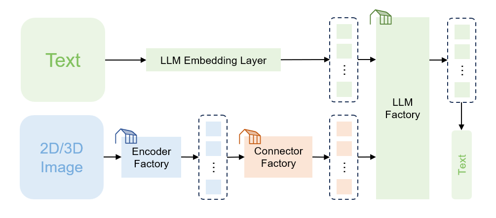

# MedM-VL: Large Vision-Language Models for Medical Image Analysis


MedM-VL is a series of medical large vision-language models (LVLMs), which can be used to directly perform simple general medical tasks, or serve as foundation models for fine-tuning specialized medical LVLMs. 

In this project, we focus on supporting **small-scale** LVLMs, making it easier to **fine-tune** for downstream tasks and **deploy** in real-world scenarios.

## :newspaper: News
+ **[2024.12.19]**: The model weights (v1.0) have been uploaded to HuggingFace.
    + [shiym2000/MedM-VL-CT-3B-en · Hugging Face](https://huggingface.co/shiym2000/MedM-VL-CT-3B-en)
    + [shiym2000/MedM-VL-2D-3B-en · Hugging Face](https://huggingface.co/shiym2000/MedM-VL-2D-3B-en)
+ **[2024.12.19]**: The complete code has been released on GitHub.


## :sparkles: Features
The hyperlink points to the model weights on HuggingFace.

<details>
<summary>MedM-VL (v1.0: English, single image input)</summary>

+ [MedM-VL-CT-3B-en](https://huggingface.co/shiym2000/MedM-VL-CT-3B-en): A medical LVLM, trained on English data, accepts text and a single 3D CT volume as input, and text-based results as output, enabling tasks such as report generation and medical VQA.
+ [MedM-VL-2D-3B-en](https://huggingface.co/shiym2000/MedM-VL-2D-3B-en): A medical LVLM, trained on English data, accepts text and a single 2D medical image as input, and text-based results as output. enabling tasks such as report generation, medical VQA, referring expression comprehension, referring expression generation and image classification.


</details>


## :package: Installation
``` bash
# 1. clone and navigate
git clone https://github.com/MSIIP/MedM-VL.git
cd MedM-VL

# 2. create a conda environment, activate it and install packages
conda create -n medm python=3.10
conda activate medm
pip install -r requirements.txt
pip install flash-attn --no-build-isolation
```


## :wrench: Getting Started

Here are some examples of `MedM-VL-CT-3B-en` in different scenarios. 

If you are confused about some parameters during usage, please refer to [Parameter Interpretation](docs/param_interpretation.md).

### 1. Train a general medical LVLM from scratch

``` bash
# 1. pre-train (annotation format: docs/example_pretrain.json)
bash scripts/train/MedM-VL-CT-3B-en/pretrain.sh

# 2. fine-tune (annotation format: docs/example_finetune.json)
bash scripts/train/MedM-VL-CT-3B-en/finetune.sh

# In fact, there is no difference in the annotation file format between
# pre-training and fine-tuning. The former is from image-text pairs
# while the latter refers to instruction tuning data.
```

### 2. Fine-tune a specialized medical LVLM with pre-trained weights

``` bash
# 1. download weights from HuggingFace
pip install -U huggingface_hub
huggingface-cli download --resume-download shiym2000/MedM-VL-CT-3B-en --local-dir work_dirs/MedM-VL-CT-3B-en

# 2. fine-tune using LoRA (annotation format: docs/example_finetune.json)
# You can choose full or LoRA fine-tuning based on available GPU memory.
bash scripts/train/finetune.sh
```

### 3. Inference

``` bash
# inference (annotation format: docs/example_inference.json)
bash scripts/eval/inference.sh

# Compared to `finetune.json``, `conversations` in `inference.json` lacks
# the final response, which will be generated by the model.
```


## :robot: Model Zoo
<table>
  <tr align="center">
    <td><b>Encoder</b></td>
    <td><b>Connector</b></td>
    <td><b>LLM</b></td>
  </tr>
  <tr valign="top">
    <td>
        <li> CLIP (2021) </li>
        <li> SigLIP (2023) </li>
        <li> M3D-CLIP (2023) </li>
    </td>
    <td>
        <li> MLP </li>
        <li> Spatial Pooling </li>
    </td>
    <td>
        <li> Phi-2 (2023) </li>
        <li> Phi-3 (2024) </li>
        <li> Qwen2.5 (2024) </li>
        <li> Llama-3.2 (2024) </li>
    </td>
  </tr>
</table>


## :page_with_curl: Evaluation Results

### 1. M3D-Bench

<table>
  <tr>
    <td rowspan="2"> Method </td>
    <td align="center" colspan="4"> Report Generation </td>
    <td align="center" colspan="5"> Medical VQA </td>
  </tr>
  <tr align="center">
    <td> BLEU </td>
    <td> ROUGE </td>
    <td> METEOR </td>
    <td> BERT-Score </td>
    <td> Accuracy </td>
    <td> BLEU </td>
    <td> ROUGE </td>
    <td> METEOR </td>
    <td> BERT-Score </td>
  </tr>
  <tr>
    <td> RadFM </td>
    <td align="center"> 12.23 </td>
    <td align="center"> 16.49 </td>
    <td align="center"> 11.57 </td>
    <td align="center"> 87.93 </td>
    <td align="center"> 19.79 </td>
    <td align="center"> 16.39 </td>
    <td align="center"> 26.13 </td>
    <td align="center"> 21.33 </td>
    <td align="center"> 88.72 </td>
  </tr>
  <tr>
    <td> M3D-LaMed </td>
    <td align="center"> 15.15 </td>
    <td align="center"> 19.55 </td>
    <td align="center"> 14.38 </td>
    <td align="center"> 88.46 </td>
    <td align="center"> 75.78 </td>
    <td align="center"> 49.38 </td>
    <td align="center"> 52.39 </td>
    <td align="center"> 33.58 </td>
    <td align="center"> 91.53 </td>
  </tr>
  <tr>
    <td> MedM-VL-CT-3B-en </td>
    <td align="center"> <b>49.81</b> </td>
    <td align="center"> <b>52.45</b> </td>
    <td align="center"> <b>49.27</b> </td>
    <td align="center"> <b>90.38</b> </td>
    <td align="center"> <b>80.12</b> </td>
    <td align="center"> <b>56.56</b> </td>
    <td align="center"> <b>59.96</b> </td>
    <td align="center"> <b>39.75</b> </td>
    <td align="center"> <b>92.85</b> </td>
  </tr>
</table>

### 2. Uni-Med

<table>
  <tr>
    <td align="center"> Method </td>
    <td align="center"> medmnist_derma </td>
    <td align="center"> medmnist_organs </td>
    <td align="center"> medpix </td>
    <td align="center"> mimic </td>
    <td align="center"> pathvqa </td>
    <td align="center"> samed_identify </td>
    <td align="center"> samed_refer </td>
    <td align="center"> slake_identify </td>
    <td align="center"> slake_refer </td>
    <td align="center"> slakevqa </td>
  </tr>
  <tr>
    <td> Med-Flamingo </td>
    <td align="center"> 1.15 </td>
    <td align="center"> 8.90 </td>
    <td align="center"> 8.14 </td>
    <td align="center"> 23.25 </td>
    <td align="center"> 33.38 </td>
    <td align="center"> - </td>
    <td align="center"> - </td>
    <td align="center"> - </td>
    <td align="center"> - </td>
    <td align="center"> 21.51 </td>
  </tr>
  <tr>
    <td> RadFM </td>
    <td align="center"> 5.14 </td>
    <td align="center"> 18.90 </td>
    <td align="center"> - </td>
    <td align="center"> 6.81 </td>
    <td align="center"> 24.83 </td>
    <td align="center"> - </td>
    <td align="center"> - </td>
    <td align="center"> - </td>
    <td align="center"> - </td>
    <td align="center"> 81.66 </td>
  </tr>
  <tr>
    <td> LLaVA-Med </td>
    <td align="center"> 25.84 </td>
    <td align="center"> 66.80 </td>
    <td align="center"> <b>15.11</b> </td>
    <td align="center"> 20.43 </td>
    <td align="center"> 37.79 </td>
    <td align="center"> 45.83 </td>
    <td align="center"> 8.64 </td>
    <td align="center"> 27.21 </td>
    <td align="center"> 4.07 </td>
    <td align="center"> 33.69 </td>
  </tr>
  <tr>
    <td> MedM-VL-2D-3B-en </td>
    <td align="center"> <b>81.05</b> </td>
    <td align="center"> <b>72.14</b> </td>
    <td align="center"> 13.16 </td>
    <td align="center"> <b>22.63</b> </td>
    <td align="center"> <b>62.86</b> </td>
    <td align="center"> <b>70.97</b> </td>
    <td align="center"> <b>20.46</b> </td>
    <td align="center"> <b>68.94</b> </td>
    <td align="center"> <b>31.92</b> </td>
    <td align="center"> <b>84.45</b> </td>
  </tr>
</table>


## :heart: Acknowledgements

We would like to express our gratitude to the following resources:

+ [**TinyLLaVA_Factory**](https://github.com/TinyLLaVA/TinyLLaVA_Factory) - An open-source modular codebase for small-scale large multimodal models (LMMs).
+ [**M3D**](https://github.com/BAAI-DCAI/M3D) - Pioneering and comprehensive series of work on the multi-modal large language model for 3D medical analysis.
