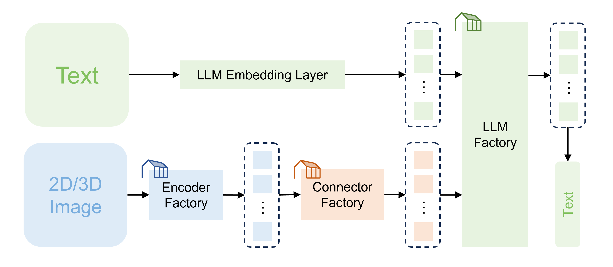

# MedM-VL: What Makes a Good Medical LVLM?

[](https://arxiv.org/abs/2504.04323) [](https://huggingface.co/collections/shiym2000/medm-vl-67f739e50d344d712eb7b010) [](./LICENSE)



MedM-VL is a **modular**, LLaVA-based codebase for medical LVLMs, supporting flexible customization of encoders, connectors, and LLMs.

MedM-VL focuses on **small-scale** medical LVLMs, designed for **direct deployment** in real-world medical scenarios or **efficient fine-tuning** on downstream tasks.


## :newspaper: News
+ **[2025.04.10]**: The model weights (v1.0) have been uploaded to HuggingFace.
  + [shiym2000/MedM-VL-2D-3B-en · Hugging Face](https://huggingface.co/shiym2000/MedM-VL-2D-3B-en)
  + [shiym2000/MedM-VL-CT-Chest-3B-en · Hugging Face](https://huggingface.co/shiym2000/MedM-VL-CT-Chest-3B-en)
  + [shiym2000/MedM-CLIP-CT · Hugging Face](https://huggingface.co/shiym2000/MedM-CLIP-CT)
+ **[2025.04.06]**: The technical report has been released on arXiv.
  + [\[2504.04323\] MedM-VL: What Makes a Good Medical LVLM?](https://arxiv.org/abs/2504.04323)
+ **[2024.12.19]**: The complete code has been released on GitHub.


## :sparkles: Features
The hyperlink points to the model weights on HuggingFace.

<details>
<summary>MedM-VL (v1.0: English, single image input)</summary>

+ [MedM-VL-2D-3B-en](https://huggingface.co/shiym2000/MedM-VL-2D-3B-en): A medical LVLM trained on **2D** medical images and **English** medical texts.
+ [MedM-VL-CT-Chest-3B-en](https://huggingface.co/shiym2000/MedM-VL-CT-Chest-3B-en): A medical LVLM trained on **3D** chest CT volumes and **English** medical texts.

</details>


## :package: Installation
``` bash
# 1. clone and navigate
git clone https://github.com/MSIIP/MedM-VL.git
cd MedM-VL

# 2. create a conda environment, activate it and install packages
conda create -n medm python=3.10
conda activate medm
pip install -r requirements.txt
pip install flash-attn --no-build-isolation
```


## :rocket: Getting Started

If you are confused about some parameters during usage, please refer to [Parameter Interpretation](docs/param_interpretation.md).

### 1. Train a general medical LVLM from scratch

``` bash
# For 2D medical LVLMs
# 1. pre-train (annotation format: docs/example_2d_pretrain.json)
bash scripts/train/MedM-VL-2D/pretrain_en.sh
# 2. fine-tune (annotation format: docs/example_2d_finetune.json)
bash scripts/train/MedM-VL-2D/finetune_en.sh

# For 3D medical LVLMs
# 1. pre-train (annotation format: docs/example_3d_pretrain.json)
bash scripts/train/MedM-VL-CT-Chest/pretrain_en.sh
# 2. fine-tune (annotation format: docs/example_3d_finetune.json)
bash scripts/train/MedM-VL-CT-Chest/finetune_en.sh

# In fact, there is no difference in the annotation file format between
# pre-training and fine-tuning. The former is from image-text pairs
# while the latter refers to instruction tuning data.
```

### 2. Fine-tune a specialized medical LVLM with pre-trained weights

``` bash
# For 2D medical LVLMs
# 1. download weights from HuggingFace
pip install -U huggingface_hub
huggingface-cli download --resume-download shiym2000/MedM-VL-2D-3B-en --local-dir work_dirs/MedM-VL-2D-3B-en
# 2. fine-tune using LoRA (annotation format: docs/example_2d_finetune.json)
bash scripts/train/finetune_2d.sh

# For 3D medical LVLMs
# 1. download weights from HuggingFace
pip install -U huggingface_hub
huggingface-cli download --resume-download shiym2000/MedM-VL-CT-Chest-3B-en --local-dir work_dirs/MedM-VL-CT-Chest-3B-en
# 2. fine-tune using LoRA (annotation format: docs/example_3d_finetune.json)
bash scripts/train/finetune_3d.sh

# You can choose full or LoRA fine-tuning based on available GPU memory.
```

### 3. Inference

``` bash
# For 2D medical LVLMs
# inference (annotation format: docs/example_2d_inference.json)
bash scripts/eval/inference_2d.sh

# For 3D medical LVLMs
# inference (annotation format: docs/example_3d_inference.json)
bash scripts/eval/inference_3d.sh

# Compared to `finetune.json``, `conversations` in `inference.json` lacks
# the final response, which will be generated by the model.
```

### 4. Demo

``` bash
# Launch a Gradio demo locally.
bash scripts/playground.sh
```


## :robot: Model Zoo
<table>
  <tr align="center">
    <td><b>Encoder</b></td>
    <td><b>Connector</b></td>
    <td><b>LLM</b></td>
  </tr>
  <tr valign="top">
    <td>
      <li><a href="https://arxiv.org/abs/2103.00020"> CLIP (2021) </a></li>
      <li><a href="https://arxiv.org/abs/2303.15343"> SigLIP (2023) </a></li>
      <li><a href="https://arxiv.org/abs/2404.00578"> M3D-CLIP (2023) </a></li>
      <li><a href="https://huggingface.co/collections/shiym2000/medm-clip-67f7afd8a3dbcff656466805"> MedM-CLIP <a></li>
    </td>
    <td>
      <li> MLP </li>
      <li> Spatial Pooling </li>
      <li> Attention Pooling </li>
    </td>
    <td>
      <li><a href="https://www.microsoft.com/en-us/research/blog/phi-2-the-surprising-power-of-small-language-models/"> Phi-2 (2023) </a></li>
      <li><a href="https://arxiv.org/abs/2404.14219"> Phi-3 (2024) </a></li>
      <li><a href="https://arxiv.org/abs/2412.15115"> Qwen2.5 (2024) </a></li>
      <li><a href="https://ai.meta.com/blog/llama-3-2-connect-2024-vision-edge-mobile-devices/"> Llama-3.2 (2024) </a></li>
    </td>
  </tr>
</table>


## :book: Citation
``` bibtex
@article{shi2025medm,
  title={MedM-VL: What Makes a Good Medical LVLM?},
  author={Shi, Yiming and Yang, Shaoshuai and Zhu, Xun and Wang, Haoyu and Li, Miao and Wu, Ji},
  journal={arXiv preprint arXiv:2504.04323},
  year={2025}
}
```


## :heart: Acknowledgements

We would like to express our gratitude to the following resources:

+ [**TinyLLaVA_Factory**](https://github.com/TinyLLaVA/TinyLLaVA_Factory) - An open-source modular codebase for small-scale large multimodal models (LMMs).
